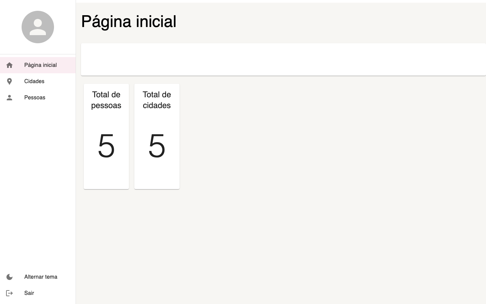
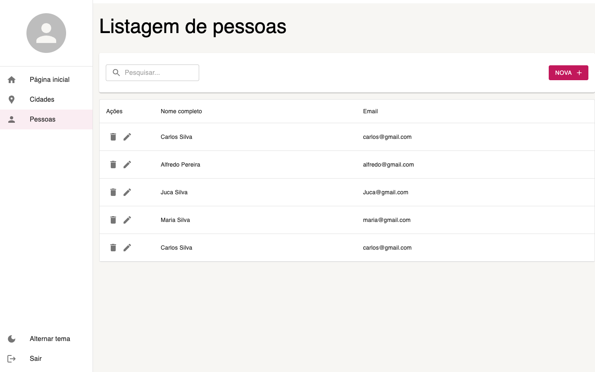
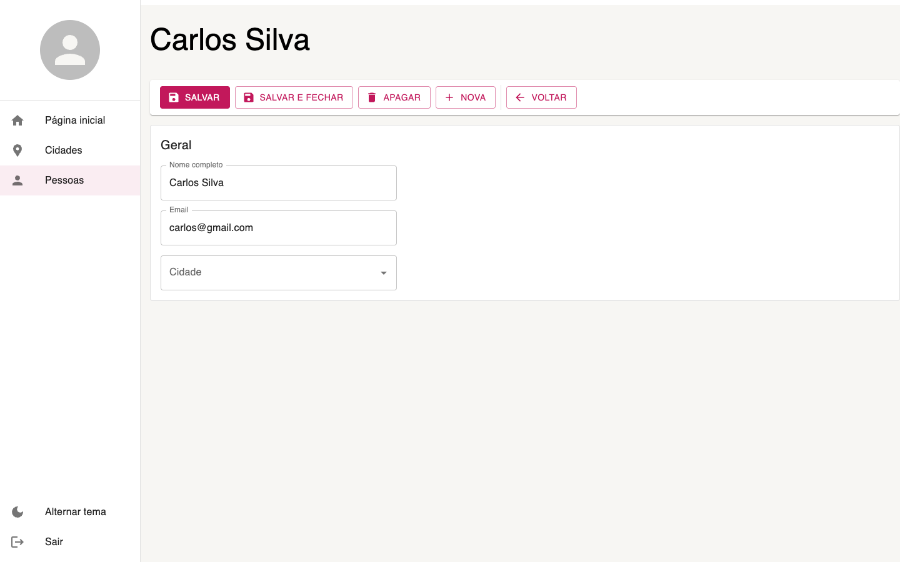
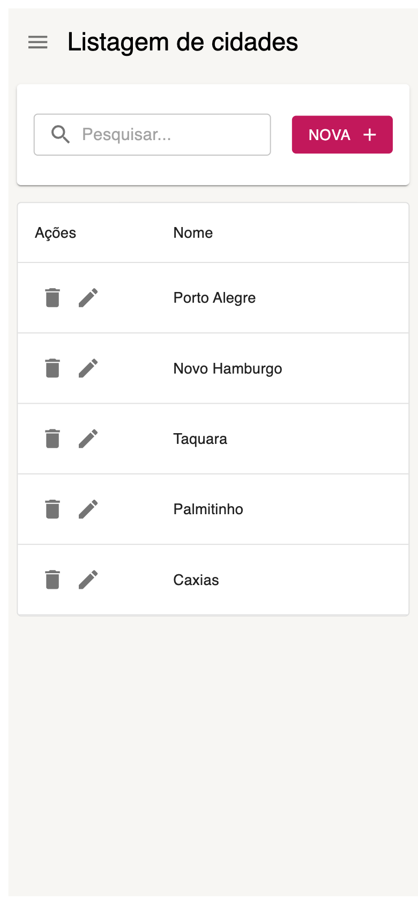

# Dashboard de Cadastro e Gestão 📊

Interface administrativa para cadastro de **pessoas** e **cidades**, com listagens paginadas, busca, formulários validados e tema claro/escuro. Os dados vêm de uma API REST simulada com `json-server`.

## 📸 Telas

| Página inicial | Listagem de pessoas |
| --- | --- |
|  |  |

| Edição de pessoa | Celular |
| --- | --- |
|  |  |

## 🚀 Tecnologias

- [React 19](https://react.dev) e [TypeScript](https://www.typescriptlang.org), rodando sobre [Next.js 15](https://nextjs.org)
- [React Router](https://reactrouter.com) para a navegação interna
- [Material UI](https://mui.com) para os componentes de interface e os temas
- [Unform](https://unform-rocketseat.vercel.app) + [Yup](https://github.com/jquense/yup) para formulários e validação, com mensagens traduzidas para o português
- [Axios](https://axios-http.com) com interceptors para tratar respostas e erros da API
- [json-server](https://github.com/typicode/json-server) como API simulada

## 🛠️ Funcionalidades

- **CRUD completo** de pessoas e cidades: criar, listar, editar e apagar.
- **Listagens paginadas** com busca por texto (com *debounce*, para não disparar uma requisição a cada tecla).
- **Autocomplete de cidade** no cadastro de pessoa, buscando na API.
- **Validação dos formulários** com Yup, mostrando os erros em cada campo.
- **Login simulado**: o token fica no `localStorage` e a aplicação só aparece após a autenticação.
- **Tema claro e escuro**, alternado pelo menu lateral.
- **Layout responsivo**: no celular, o menu lateral vira uma gaveta aberta pelo botão ☰.

## 📁 Estrutura

```
src/app/
├── Pages/               # Telas: dashboard, pessoas e cidades (listagem e detalhe)
├── Routes/              # Rotas e itens do menu lateral
└── Shared/
    ├── components/      # Login, menu lateral e barras de ferramentas
    ├── contexts/        # Autenticação, tema e menu lateral
    ├── forms/           # Wrappers do Unform e traduções do Yup
    ├── hooks/           # useDebounce
    ├── layouts/         # Layout base das páginas
    ├── services/api/    # Axios, interceptors e serviços de pessoas, cidades e auth
    ├── environment/     # Constantes (URL da API, itens por página etc.)
    └── themes/          # Temas claro e escuro
mock/database.json       # Dados usados pelo json-server
```

## ⚙️ Como rodar localmente

1. Clone o repositório e instale as dependências:

   ```bash
   git clone https://github.com/Anna-Madeira/project.git
   cd project
   npm install
   ```

2. Em um terminal, suba a API simulada na porta 3333:

   ```bash
   npm run server
   ```

3. Em outro terminal, suba a aplicação:

   ```bash
   npm run dev
   ```

4. Acesse `http://localhost:3000` e entre com qualquer e-mail válido e uma senha de pelo menos 5 caracteres (o login é simulado).

## 🧠 Desafios técnicos

Como ex-analista de sistemas, foquei em deixar a arquitetura fácil de escalar: serviços de API separados por entidade, componentes de listagem e de detalhe reaproveitados entre as telas e configurações centralizadas em `environment`. O maior desafio foi integrar a validação do Yup aos formulários do Unform, para que a interface mostrasse os erros de preenchimento de forma clara em cada campo.
